<div align="center">

# 🌊 SalinityCygnss

### Monitoring Saline Intrusion Using CYGNSS Data and Machine Learning

*Applying GNSS-Reflectometry technology and Machine Learning to map saline intrusion in the Mekong Delta*

<br>

[](https://github.com/quanguet0409/SalinityCygnss)
[](https://github.com/quanguet0409/SalinityCygnss)
[](https://www.python.org/)
[](LICENSE)

<br>

**[📌 Introduction](#-introduction)** |
**[🌐 Demo App](#-demo-app)** |
**[🔄 Methodology](#-methodology)** |
**[🚀 Installation](#-installation)** |
**[💻 Usage](#-usage)** |
**[🤖 Models](#-models)** |
**[📊 Results](#-results)** |
**[📚 Data Sources](#-data-sources)**

---

**English** | [Tiếng Việt](README.md)

</div>

<br>

<div align="center">

## 📌 Introduction

</div>

**SalinityCygnss** leverages **CYGNSS (Cyclone Global Navigation Satellite System)** data - GNSS-Reflectometry technology combined with advanced **Machine Learning** algorithms to map and predict saline intrusion in the Mekong Delta.

### 📍 Study Areas

1. **Mekong Delta 2025** 
2. **Tra Vinh 2024** 
3. **Ben Tre 2020** 
4. **Bac Lieu 2019**

### 🎯 Research Significance

> Saline intrusion is one of the biggest challenges in the Mekong Delta, directly affecting **19 million people** and the nation's food security.

**This research provides:**

```diff
+ Cost-effective monitoring solution
+ Support for agricultural planning and water resource management
```

<br>

---

<div align="center">

## 🌐 Demo App

</div>

<div align="center">

### 🚀 Try It Now

**View interactive saline intrusion maps on Google Earth Engine**

<br>

[](https://ee-hanoi688.projects.earthengine.app/view/soil-salinity)

<br>

> 📍 **Features:** View monthly saline intrusion prediction maps, compare models, and explore field data

</div>

<br>

---

<div align="center">

## 🔄 Methodology

</div>

<div align="center">

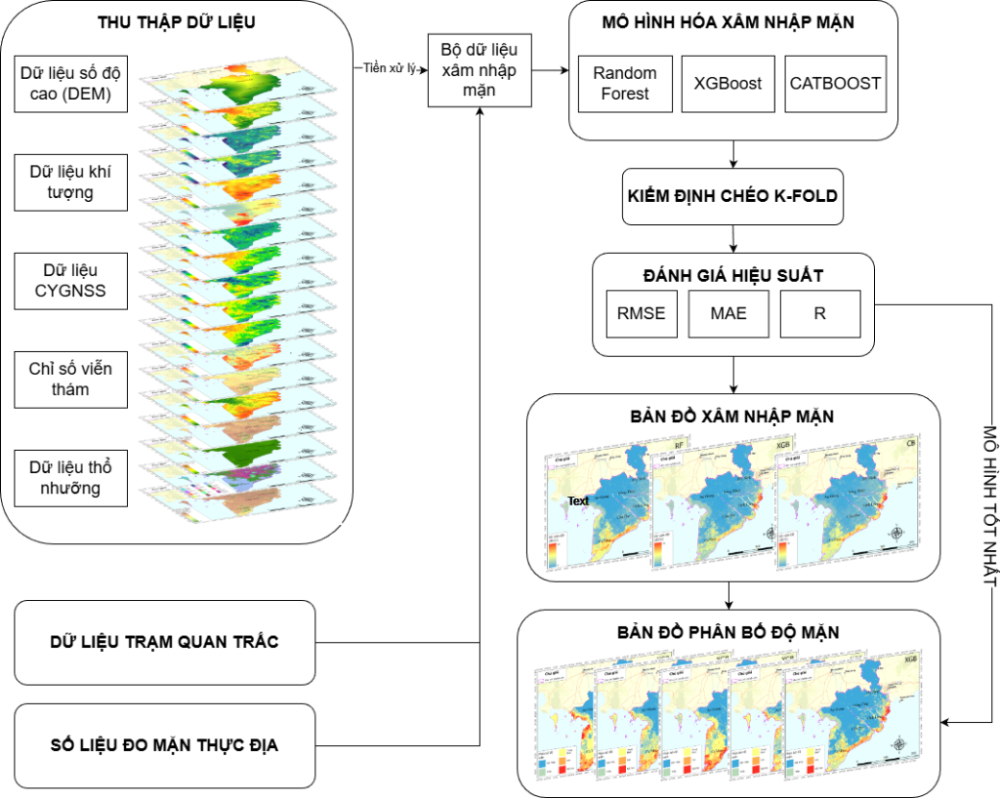

*Figure 1: Saline intrusion research workflow using CYGNSS and Machine Learning*

</div>

### Main Steps

1. **Data Collection**
   - CYGNSS Data: SR (Surface Reflectivity)
   - Remote Sensing: NDVI, NDSI, LST, LULC
   - Topography: DEM (Digital Elevation Model)
   - Environmental: SM (Soil Moisture)
   - Soil Properties: Sand, Clay, Bulk Density
   - Salinity Index: SI1-SI5

2. **Field Data** → Field EC measurements (dS/m), Monitoring stations

3. **Preprocessing** → Normalization

4. **Modeling** → Random Forest, XGBoost, CatBoost

5. **Evaluation** → R (Correlation), RMSE, MAE, K-Fold Validation

6. **Output** → Monthly saline intrusion maps (1-5/2025)

---

## 🚀 Installation

### Requirements

- Python 3.8+
- Jupyter Notebook
- Git

### Quick Install

```bash
git clone https://github.com/quanguet0409/SalinityCygnss.git
cd SalinityCygnss
pip install -r requirements.txt
```

### Main Libraries

`numpy` • `pandas` • `scikit-learn` • `xgboost` • `catboost` • `matplotlib` • `seaborn` • `geopandas` • `rasterio`

---

## 💻 Usage

### Running Models

1. Open the corresponding Jupyter Notebook:
   ```bash
   jupyter notebook Mekong2025/Model/XGB.ipynb
   ```

2. Run cells sequentially

3. Predictions will be saved in `Model Results/`

### Notebook Workflow

1. Load data → 2. Preprocessing → 3. Training → 4. Evaluation → 5. Prediction → 6. Visualization

---

## 📂 Project Structure

```
SalinityCygnss/
├── Mekong2025/              # Mekong Delta 2025 (latest)
│   ├── Data/                # 91 files
│   ├── Model/               # RF, XGB, CB notebooks
│   ├── Model Results/       # 15 output files
│   ├── Results/             # Prediction maps
│   └── SHP/                 # Mekong Delta shapefiles
├── TraVinh2024/             # Tra Vinh
│   ├── Data/                # 19 files
│   └── SHP/                 # 8 shapefiles
├── BenTre2020/              # Ben Tre
│   ├── Data/                # 19 files
│   ├── Model/               # 3 models
│   └── Results/             # 3 outputs
├── BacLieu2019/             # Bac Lieu
├── LICENSE
├── README.md
└── flowchart.png
```

---

## 🤖 Models

### 1. Random Forest (RF)
Ensemble of decision trees, resistant to overfitting, handles non-linear relationships.

### 2. XGBoost (XGB)
High-performance gradient boosting, automatic regularization, handles missing values.

### 3. CatBoost (CB)
Excellent categorical feature handling, GPU support, fast prediction speed.

### Model Evaluation

- **R** - Correlation Coefficient
- **RMSE** - Root Mean Square Error
- **MAE** - Mean Absolute Error
- **K-Fold Validation** - Cross-validation

<br>

---

<div align="center">

## 📊 Results

</div>

### 📈 Model Performance

Three machine learning models trained and evaluated on **test set**:

<div align="center">

| 📊 Metric | 📝 Meaning | ✅ Better Value |
|:--------:|:-----------|:--------------:|
| **R** | Correlation Coefficient | ↑ Closer to 1 |
| **RMSE** | Root Mean Square Error | ↓ Lower |
| **MAE** | Mean Absolute Error | ↓ Lower |

</div>

<br>

### 🏆 Detailed Performance Comparison

<div align="center">

<table>
<thead>
  <tr>
    <th rowspan="2">Algorithm</th>
    <th colspan="3">Training Set</th>
    <th colspan="3">Test Set</th>
  </tr>
  <tr>
    <th>RMSE (dS/m)</th>
    <th>MAE (dS/m)</th>
    <th>R</th>
    <th>RMSE (dS/m)</th>
    <th>MAE (dS/m)</th>
    <th>R</th>
  </tr>
</thead>
<tbody>
  <tr>
    <td>Random Forest</td>
    <td>1.59</td>
    <td>0.77</td>
    <td>0.94</td>
    <td>2.73</td>
    <td>1.37</td>
    <td>0.78</td>
  </tr>
  <tr>
    <td><strong>XGBoost</strong> ⭐</td>
    <td><strong>1.37</strong></td>
    <td><strong>0.69</strong></td>
    <td><strong>0.95</strong></td>
    <td><strong>2.55</strong></td>
    <td><strong>1.31</strong></td>
    <td><strong>0.81</strong></td>
  </tr>
  <tr>
    <td>CatBoost</td>
    <td>1.72</td>
    <td>0.96</td>
    <td>0.94</td>
    <td>2.65</td>
    <td>1.36</td>
    <td>0.80</td>
  </tr>
</tbody>
</table>

</div>

> **Note**: 
> - ⭐ = Best model (XGBoost has lowest RMSE and highest R on test set)

<br>

### 📍 Field Monitoring Station Data

<div align="center">

> 7 field monitoring stations distributed across the Mekong Delta

</div>

<div align="center">

| Station Name | Province | Month 1 | Month 2 | Month 3 | Month 4 | Month 5 |
|:----------|:------------|:--------:|:--------:|:--------:|:--------:|:--------:|
| Tuyen Nhon | Long An | 0.033 | 0.2 | 0.37 | 0.23 | 0.2 |
| Ben Trai | Ben Tre | 18.5 | 18.67 | 23.43 | 18.73 | 19.6 |
| Dai Ngai | Soc Trang | 3.4 | 6.77 | 7.37 | 4.6 | 1.9 |
| Go Quao | Kien Giang | 2.3 | 3.73 | 2.33 | 4.33 | 3.6 |
| Vam Kenh | Tien Giang | 21.43 | 21.53 | 21.8 | 20.2 | 17.6 |
| Tra Kha | Tra Vinh | 15.6 | 17.97 | 16.23 | 13.03 | 12.1 |
| Song Doc | Ca Mau | 30.2 | 31 | 33.47 | 33.77 | 34.3 |

*Table: Salinity measurements at stations (dS/m)*

</div>

<br>

### 💡 Analysis

<div align="center">

| Model | Assessment |
|:-------:|:---------|
| **XGBoost** 🥇 | Best performance with lowest RMSE (2.55 dS/m) and highest R (0.81) |
| **Random Forest** 🥈 | High stability but higher RMSE (2.73 dS/m) |
| **CatBoost** 🥉 | Balance between performance and training time |

</div>


<br>

---

<div align="center">

## 🗺️ Saline Intrusion Maps

</div>

### 📅 Temporal Monitoring (Months 1-5/2025)

<div align="center">

*Saline intrusion predictions for the first 5 months of 2025 in the Mekong Delta*

**Click on each model to view details**

</div>

<details>
<summary><b>CatBoost - Click to view 5 months</b></summary>

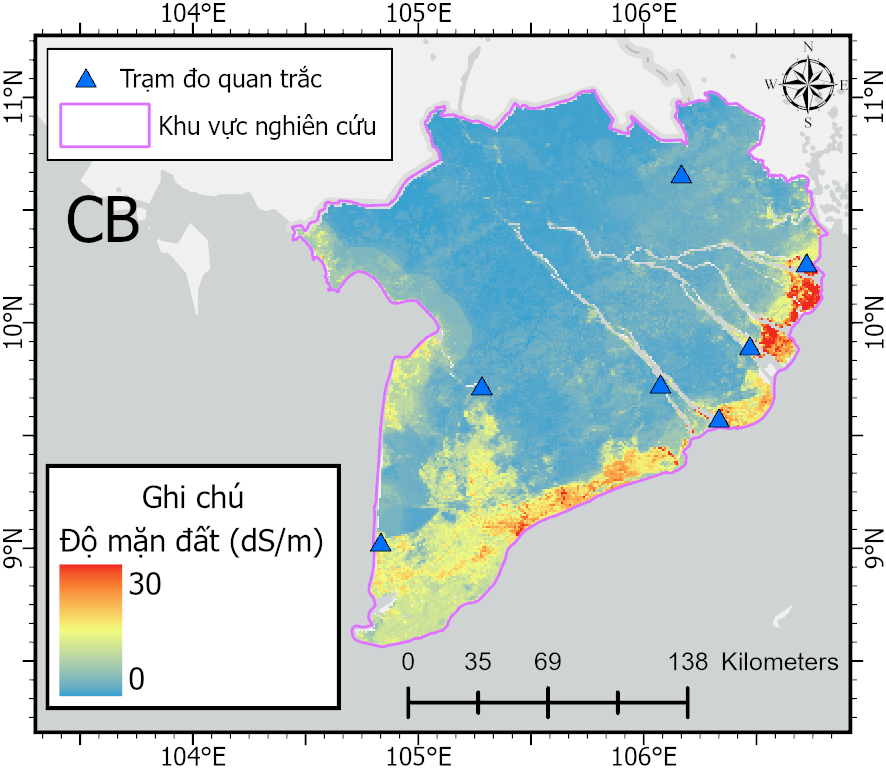

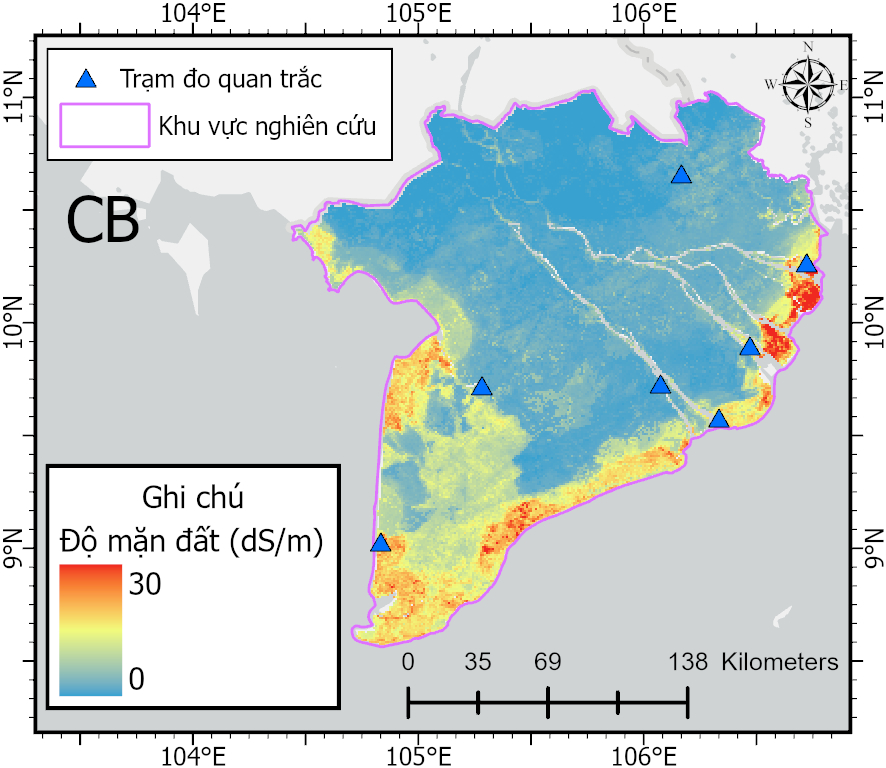
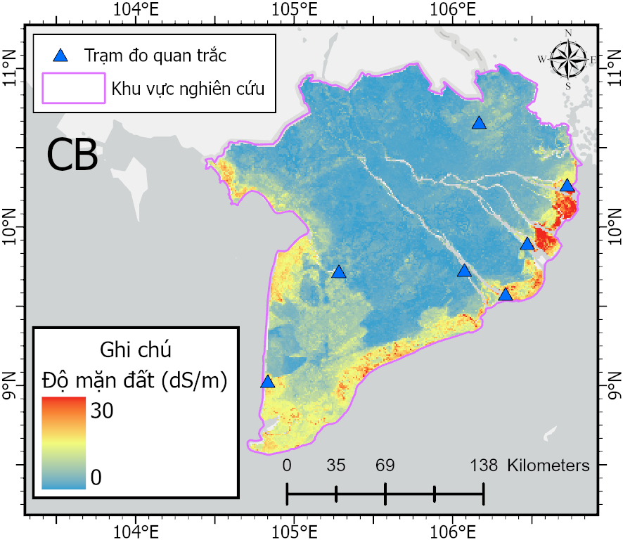
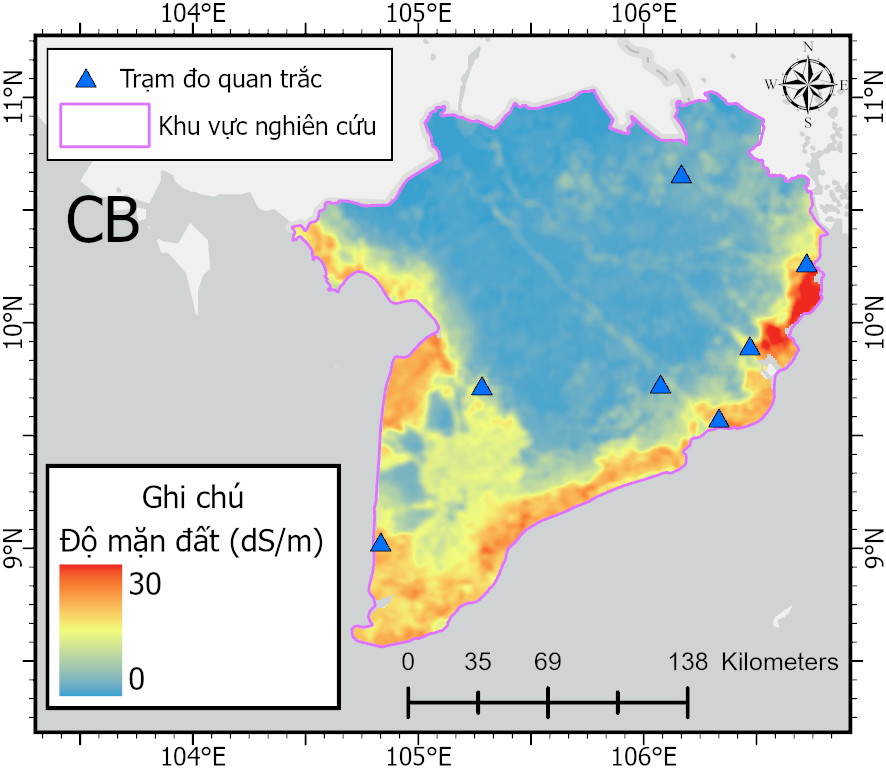

</details>

<details>
<summary><b>Random Forest - Click to view 5 months</b></summary>

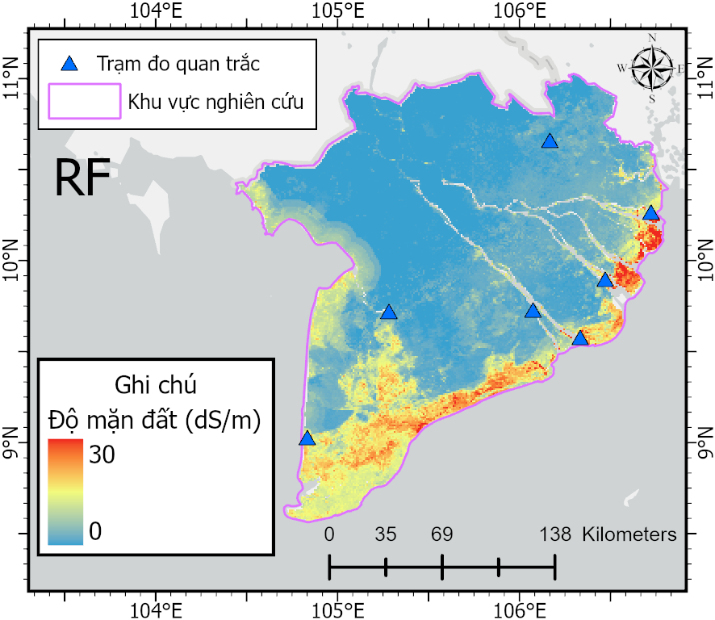
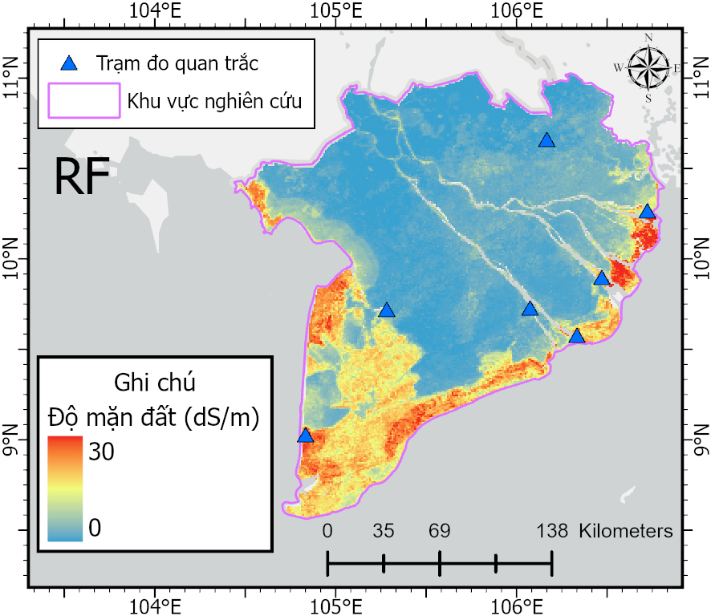
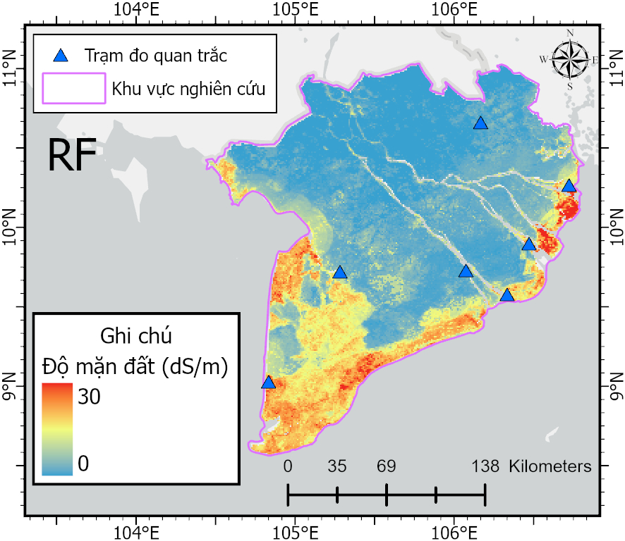
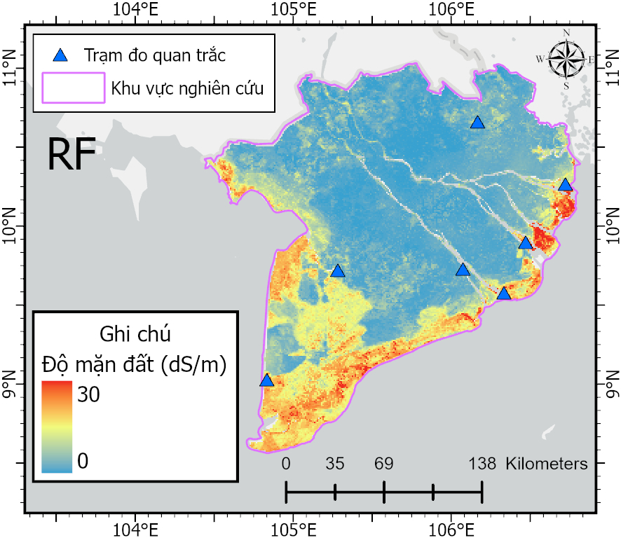
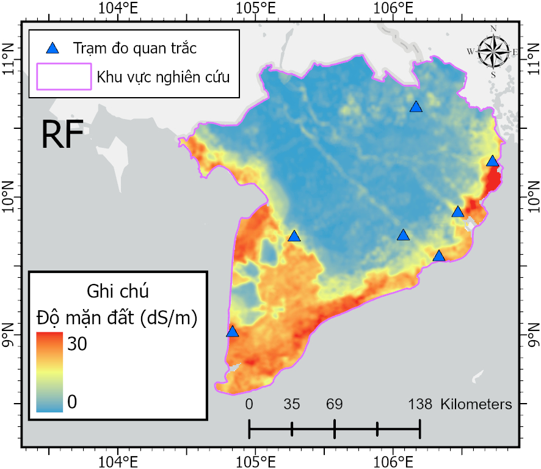

</details>

<details>
<summary><b>XGBoost - Click to view 5 months</b></summary>

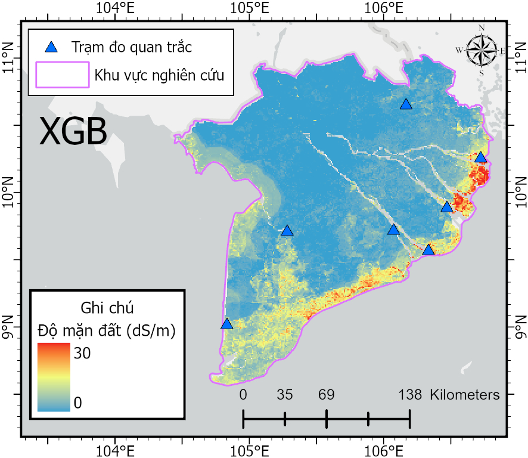
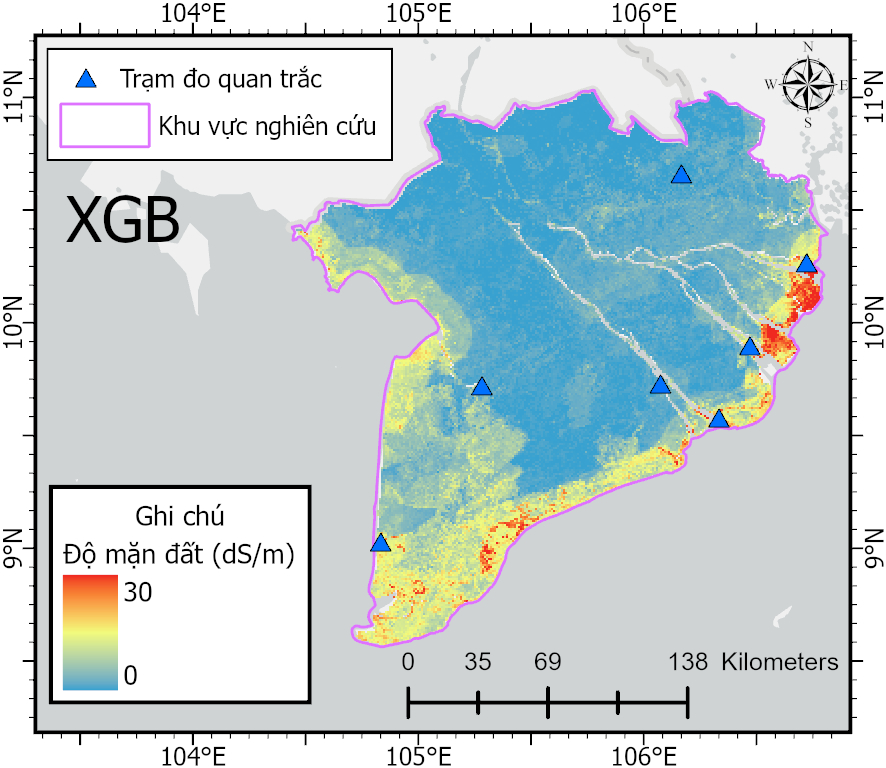
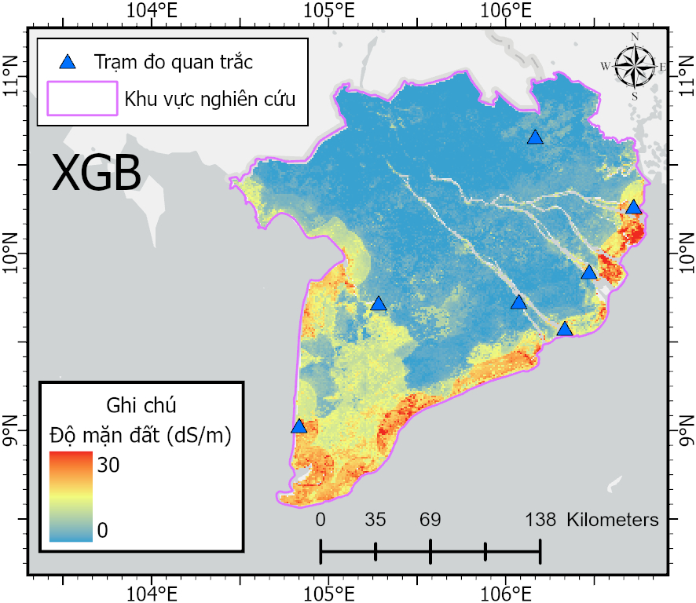
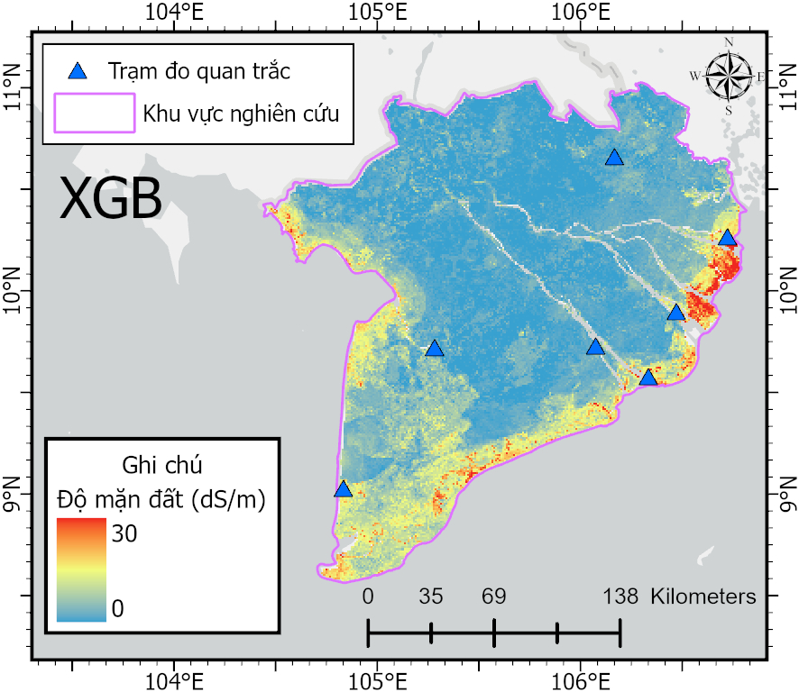
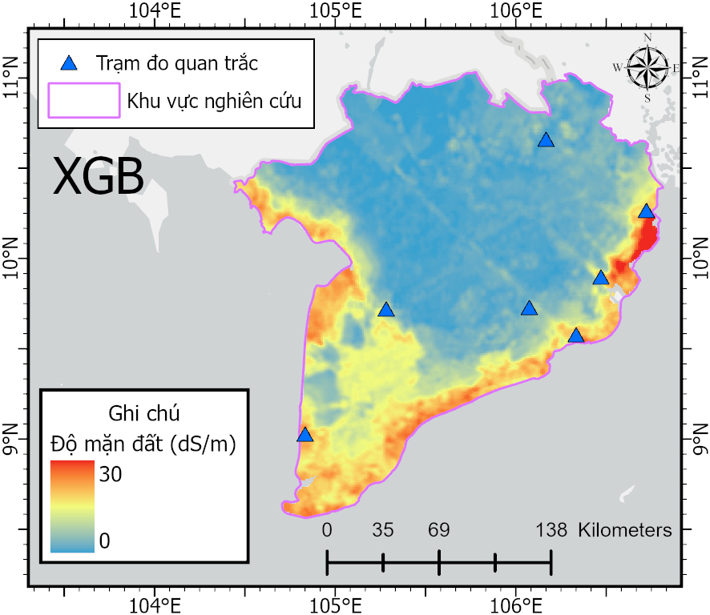

</details>

### 🎯 Important Features

Features used include:
- **CYGNSS Data**: SR (Surface Reflectivity)
- **Spectral Indices**: NDVI, NDSI, Salinity Index (SI1-SI5), SWIR1, SWIR2
- **Environmental**: SM (Soil Moisture), LST (Land Surface Temperature), DEM
- **Soil Properties**: Sand, Clay, Bulk Density
- **Land Use**: LULC

*Detailed results and additional monthly maps available in `Mekong2025/Results/`*

> 📌 **Additional Data:** For supplementary or raw data, please contact via email: **quanghieuminh14@gmail.com**

---

## 📚 Data Sources

<div align="center">


**SPACE TECHNOLOGY INSTITUTE**  
University of Engineering and Technology - Vietnam National University, Hanoi

</div>

### Primary Data

**CYGNSS Data**
- Provided by: **MSc. Hoang Tich Phuc** - phucth@vnu.edu.vn
- Institution: Space Technology Institute - UET - VNU Hanoi

**Field Salinity Data**
- Provided by: **Dr. Ha Minh Cuong** - cuonghm@vnu.edu.vn
- Institution: Space Technology Institute - UET - VNU Hanoi

### Supporting Data

Digital Elevation Model (DEM) • Land Use/Cover • Soil Properties • Climate Variables

---

## 📜 License

This project uses the MIT License - see [LICENSE](LICENSE).

---

## 📧 Contact

**Author**: Pham Minh Quang  
**Email**: quanghieuminh14@gmail.com  
**Organization**: Space Technology Institute - UET - VNU Hanoi

**GitHub**: [https://github.com/quanguet0409/SalinityCygnss](https://github.com/quanguet0409/SalinityCygnss)

---

## 🙏 Acknowledgments
- Dr. Ha Minh Cuong and MSc. Hoang Tich Phuc
- Space Technology Institute - UET - VNU Hanoi

---

## 📖 Citation

```bibtex
@software{SalinityCygnss2025,
  author = {Pham Minh Quang},
  title = {SalinityCygnss: Monitoring Saline Intrusion Using CYGNSS Data and Machine Learning},
  year = {2025},
  publisher = {GitHub},
  url = {https://github.com/quanguet0409/SalinityCygnss}
}
```

---
