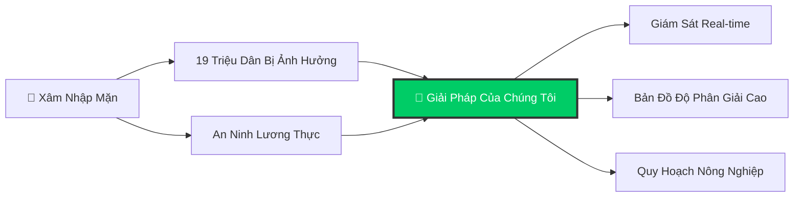
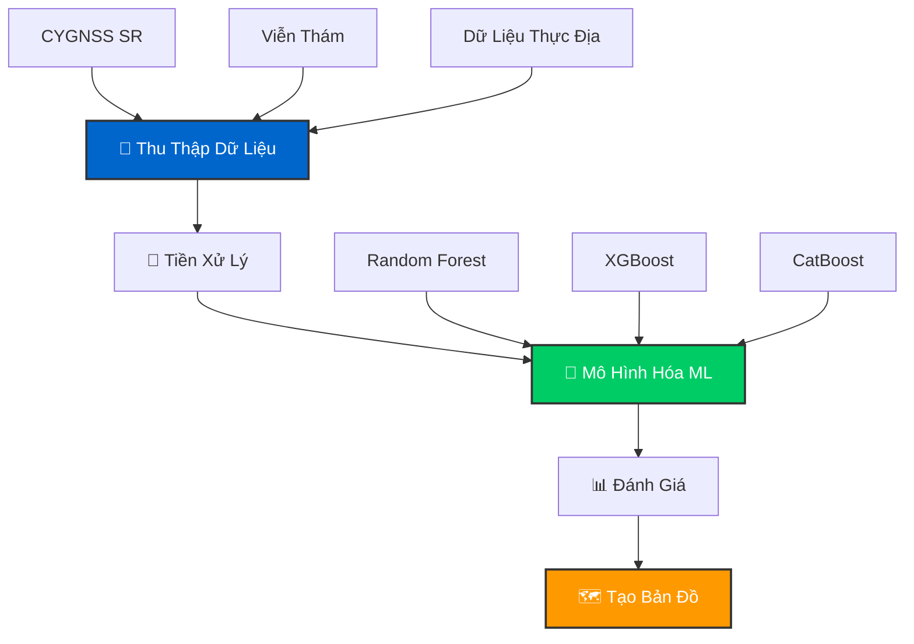
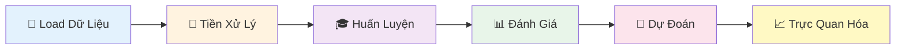

<div align="center">

<!-- Animated Header -->


<h3>
  
</h3>

<br>

<!-- Badges with Animation -->
<p>
  <a href="https://github.com/quanguet0409/SalinityCygnss">
    
  </a>
  <a href="https://github.com/quanguet0409/SalinityCygnss">
    
  </a>
  <a href="https://www.python.org/">
    
  </a>
  <a href="LICENSE">
    
  </a>
</p>

<br>

<!-- Navigation with Emojis -->
<p>
  <a href="#-giới-thiệu"><kbd> <br> 📌 Giới Thiệu <br> </kbd></a>
  <a href="#-demo-app"><kbd> <br> 🌐 Demo App <br> </kbd></a>
  <a href="#-quy-trình-nghiên-cứu"><kbd> <br> 🔄 Quy Trình <br> </kbd></a>
  <a href="#-cài-đặt"><kbd> <br> 🚀 Cài Đặt <br> </kbd></a>
  <a href="#-sử-dụng"><kbd> <br> 💻 Sử Dụng <br> </kbd></a>
  <a href="#-các-mô-hình"><kbd> <br> 🤖 Mô Hình <br> </kbd></a>
  <a href="#-kết-quả"><kbd> <br> 📊 Kết Quả <br> </kbd></a>
  <a href="#-nguồn-dữ-liệu"><kbd> <br> 📚 Dữ Liệu <br> </kbd></a>
</p>

<br>

<!-- Language Switcher with Flags -->
<p>
  <a href="README.en.md">
    
  </a>
  <a href="README.md">
    
  </a>
</p>

</div>

<br>

<!-- Divider -->


<br>

## 📌 Giới Thiệu

<div align="center">
  
  <p><i>Chòm sao vệ tinh CYGNSS quan sát Trái Đất</i></p>
</div>

<br>

**SalinityCygnss** khai thác dữ liệu **CYGNSS (Cyclone Global Navigation Satellite System)** - công nghệ GNSS-Reflectometry kết hợp các thuật toán **Machine Learning** tiên tiến để lập bản đồ và dự đoán xâm nhập mặn tại Đồng Bằng Sông Cửu Long.

<br>

<table align="center">
<tr>
<td align="center" width="25%">
  <br>
  <b>ĐBSCL 2025</b><br>
  <sub>Nghiên cứu toàn diện<br>(5 tháng: 1-5/2025)</sub>
</td>
<td align="center" width="25%">
  <br>
  <b>Trà Vinh 2024</b><br>
  <sub>Phân tích khu vực</sub>
</td>
<td align="center" width="25%">
  <br>
  <b>Bến Tre 2020</b><br>
  <sub>Dữ liệu so sánh</sub>
</td>
<td align="center" width="25%">
  <br>
  <b>Bạc Liêu 2019</b><br>
  <sub>Baseline</sub>
</td>
</tr>
</table>

<br>

### 🎯 Ý Nghĩa Nghiên Cứu

<div align="center">



</div>

> 💡 Xâm nhập mặn là một trong những thách thức lớn nhất tại ĐBSCL, ảnh hưởng trực tiếp đến **19 triệu dân** và nguồn lương thực quốc gia.

**Nghiên cứu cung cấp:**

<div align="center">

| Tính Năng | Mô Tả |
|:-------:|:------------|
| 💰 **Tiết Kiệm Chi Phí** | Giải pháp giám sát chi phí thấp sử dụng dữ liệu vệ tinh |
| 📡 **Real-Time** | Bản đồ độ mặn cập nhật để hỗ trợ ra quyết định |
| 🎯 **Độ Chính Xác Cao** | Độ phân giải không gian 30m cho phân tích chi tiết |
| 🌾 **Hỗ Trợ Nông Nghiệp** | Công cụ quy hoạch cho nông dân và nhà hoạch định chính sách |

</div>

<br>


<br>

## 🌐 Demo App

<div align="center">

### 🚀 Trải Nghiệm Ngay


<br><br>

**Xem bản đồ xâm nhập mặn tương tác trên Google Earth Engine**

<br>

<a href="https://ee-hanoi688.projects.earthengine.app/view/soil-salinity">
  
</a>

<br><br>

<table>
<tr>
<td align="center" width="33%">
  <br>
  <b>Bản Đồ Theo Tháng</b><br>
  <sub>Xem dự đoán cho từng tháng</sub>
</td>
<td align="center" width="33%">
  <br>
  <b>So Sánh Mô Hình</b><br>
  <sub>So sánh RF, XGBoost, CatBoost</sub>
</td>
<td align="center" width="33%">
  <br>
  <b>Dữ Liệu Thực Địa</b><br>
  <sub>Khám phá các trạm quan trắc</sub>
</td>
</tr>
</table>

</div>

<br>


<br>

## 🔄 Quy Trình Nghiên Cứu

<div align="center">


*Hình 1: Quy trình nghiên cứu xâm nhập mặn sử dụng CYGNSS và Machine Learning*

</div>

<br>

### 📋 Các Bước Chính

<div align="center">



</div>

<details>
<summary><b>🔍 Nhấp để xem quy trình chi tiết</b></summary>

<br>

1. **📡 Thu Thập Dữ Liệu**
   - Dữ liệu CYGNSS: SR (Surface Reflectivity)
   - Viễn thám: NDVI, NDSI, LST, LULC
   - Địa hình: DEM (Digital Elevation Model)
   - Environmental: SM (Soil Moisture)
   - Thổ nhưỡng: Sand, Clay, Bulk Density
   - Salinity Index: SI1-SI5

2. **🔬 Dữ Liệu Thực Địa** → Đo điểm mặn thực địa EC (dS/m), Trạm đo quan trắc

3. **⚙️ Tiền Xử Lý** → Chuẩn hóa & Feature Engineering

4. **🤖 Mô Hình Hóa** → Random Forest, XGBoost, CatBoost

5. **📊 Đánh Giá** → R (Correlation), RMSE, MAE, K-Fold Validation

6. **🗺️ Xuất Kết Quả** → Bản đồ xâm nhập mặn theo tháng (1-5/2025)

</details>

<br>


<br>

## 🚀 Cài Đặt

<div align="center">

### ⚡ Cài Đặt Nhanh

</div>

```bash
# Clone repository
git clone https://github.com/quanguet0409/SalinityCygnss.git

# Di chuyển vào thư mục dự án
cd SalinityCygnss

# Cài đặt dependencies
pip install -r requirements.txt
```

<div align="center">

### 📦 Thư Viện Chính

<table>
<tr>
<td align="center"><br><b>NumPy</b></td>
<td align="center"><br><b>Pandas</b></td>
<td align="center"><br><b>Scikit-learn</b></td>
<td align="center"><br><b>XGBoost</b></td>
<td align="center"><br><b>CatBoost</b></td>
</tr>
</table>

</div>

<br>


<br>

## 💻 Sử Dụng

### 🎯 Chạy Mô Hình

```bash
# Mở Jupyter Notebook
jupyter notebook Mekong2025/Model/XGB.ipynb

# Chạy từng cell theo thứ tự
# Kết quả sẽ được lưu trong Model Results/
```

<div align="center">

### 🔄 Quy Trình Pipeline



</div>

<br>


<br>

## 📂 Cấu Trúc Nghiên Cứu

```
SalinityCygnss/
├── 📁 Mekong2025/              # ĐBSCL 2025 (mới nhất)
│   ├── 📊 Data/                # 91 files
│   ├── 🤖 Model/               # RF, XGB, CB notebooks
│   ├── 📈 Model Results/       # 15 output files
│   ├── 🗺️ Results/             # Bản đồ dự đoán
│   └── 🌍 SHP/                 # Shapefiles
├── 📁 TraVinh2024/             # Trà Vinh
├── 📁 BenTre2020/              # Bến Tre
├── 📁 BacLieu2019/             # Bạc Liêu
├── 📜 LICENSE
└── 📖 README.md
```

<br>


<br>

## 🤖 Các Mô Hình

<div align="center">

<table>
<tr>
<td align="center" width="33%">
  <br>
  <h3>🌲 Random Forest</h3>
  <sub>Tổng hợp nhiều cây quyết định<br>Kháng overfitting<br>Xử lý mối quan hệ phi tuyến</sub>
</td>
<td align="center" width="33%">
  <br>
  <h3>⚡ XGBoost</h3>
  <sub>Gradient boosting hiệu suất cao<br>Điều chuẩn tự động<br>Xử lý missing values</sub>
</td>
<td align="center" width="33%">
  <br>
  <h3>🐱 CatBoost</h3>
  <sub>Xử lý đặc trưng phân loại tốt<br>Hỗ trợ GPU<br>Tốc độ dự đoán nhanh</sub>
</td>
</tr>
</table>

</div>

<br>

### 📊 Chỉ Số Đánh Giá

<div align="center">

| Chỉ Số | Mô Tả | Mục Tiêu |
|:------:|:------|:--------:|
| **R** | Hệ số tương quan | ↑ Cao hơn |
| **RMSE** | Sai số bình phương trung bình | ↓ Thấp hơn |
| **MAE** | Sai số tuyệt đối trung bình | ↓ Thấp hơn |

</div>

<br>


<br>

## 📊 Kết Quả

<div align="center">

### 🏆 So Sánh Hiệu Suất Mô Hình


</div>

<br>

<table align="center">
<thead>
  <tr>
    <th rowspan="2">🤖 Thuật Toán</th>
    <th colspan="3">📚 Tập Huấn Luyện</th>
    <th colspan="3">🧪 Tập Kiểm Tra</th>
  </tr>
  <tr>
    <th>RMSE</th>
    <th>MAE</th>
    <th>R</th>
    <th>RMSE</th>
    <th>MAE</th>
    <th>R</th>
  </tr>
</thead>
<tbody>
  <tr>
    <td>🌲 Random Forest</td>
    <td>1.59</td>
    <td>0.77</td>
    <td>0.94</td>
    <td>2.73</td>
    <td>1.37</td>
    <td>0.78</td>
  </tr>
  <tr style="background-color: #fff3cd;">
    <td><b>⚡ XGBoost</b> 🥇</td>
    <td><b>1.37</b></td>
    <td><b>0.69</b></td>
    <td><b>0.95</b></td>
    <td><b>2.55</b></td>
    <td><b>1.31</b></td>
    <td><b>0.81</b></td>
  </tr>
  <tr>
    <td>🐱 CatBoost</td>
    <td>1.72</td>
    <td>0.96</td>
    <td>0.94</td>
    <td>2.65</td>
    <td>1.36</td>
    <td>0.80</td>
  </tr>
</tbody>
</table>

<div align="center">

> 🥇 **Chiến Thắng:** XGBoost đạt hiệu suất tốt nhất với RMSE thấp nhất (2.55 dS/m) và R cao nhất (0.81) trên tập kiểm tra

</div>

<br>

### 📍 Dữ Liệu Trạm Đo Mặn Thực Địa

<div align="center">


<br>

*7 trạm đo mặn thực địa phân bố khắp Đồng Bằng Sông Cửu Long*

</div>

<br>

<table align="center">
<thead>
  <tr>
    <th>📍 Trạm</th>
    <th>🌏 Tỉnh</th>
    <th>T1</th>
    <th>T2</th>
    <th>T3</th>
    <th>T4</th>
    <th>T5</th>
  </tr>
</thead>
<tbody>
  <tr>
    <td>Tuyên Nhơn</td>
    <td>Long An</td>
    <td>0.033</td>
    <td>0.2</td>
    <td>0.37</td>
    <td>0.23</td>
    <td>0.2</td>
  </tr>
  <tr>
    <td>Bến Trại</td>
    <td>Bến Tre</td>
    <td>18.5</td>
    <td>18.67</td>
    <td>23.43</td>
    <td>18.73</td>
    <td>19.6</td>
  </tr>
  <tr>
    <td>Đại Ngãi</td>
    <td>Sóc Trăng</td>
    <td>3.4</td>
    <td>6.77</td>
    <td>7.37</td>
    <td>4.6</td>
    <td>1.9</td>
  </tr>
  <tr>
    <td>Gò Quao</td>
    <td>Kiên Giang</td>
    <td>2.3</td>
    <td>3.73</td>
    <td>2.33</td>
    <td>4.33</td>
    <td>3.6</td>
  </tr>
  <tr>
    <td>Văm Kénh</td>
    <td>Tiền Giang</td>
    <td>21.43</td>
    <td>21.53</td>
    <td>21.8</td>
    <td>20.2</td>
    <td>17.6</td>
  </tr>
  <tr>
    <td>Trà Kha</td>
    <td>Trà Vinh</td>
    <td>15.6</td>
    <td>17.97</td>
    <td>16.23</td>
    <td>13.03</td>
    <td>12.1</td>
  </tr>
  <tr>
    <td>Sông Đốc</td>
    <td>Cà Mau</td>
    <td>30.2</td>
    <td>31</td>
    <td>33.47</td>
    <td>33.77</td>
    <td>34.3</td>
  </tr>
</tbody>
</table>

<div align="center">

*Bảng: Giá trị đo mặn tại các trạm (dS/m)*

</div>

<br>

### 💡 Nhận Xét

<div align="center">

<table>
<tr>
<td align="center" width="33%">
  <br>
  <h4>🥇 XGBoost</h4>
  <sub>Hiệu suất tổng thể tốt nhất<br>RMSE: 2.55 dS/m | R: 0.81</sub>
</td>
<td align="center" width="33%">
  <br>
  <h4>🥈 Random Forest</h4>
  <sub>Độ ổn định cao<br>RMSE: 2.73 dS/m | R: 0.78</sub>
</td>
<td align="center" width="33%">
  <br>
  <h4>🥉 CatBoost</h4>
  <sub>Hiệu suất cân bằng<br>RMSE: 2.65 dS/m | R: 0.80</sub>
</td>
</tr>
</table>

</div>

<br>


<br>

## 🗺️ Bản Đồ Xâm Nhập Mặn

<div align="center">

### 📅 Theo Dõi Biến Đổi Theo Thời Gian (Tháng 1-5/2025)


<br>

*Kết quả dự đoán xâm nhập mặn cho 5 tháng đầu năm 2025 tại ĐBSCL*

</div>

<br>

<details>
<summary><b>🐱 CatBoost - Nhấp để xem 5 tháng</b></summary>

<br>

<div align="center">


</div>

</details>

<details>
<summary><b>🌲 Random Forest - Nhấp để xem 5 tháng</b></summary>

<br>

<div align="center">


</div>

</details>

<details>
<summary><b>⚡ XGBoost - Nhấp để xem 5 tháng</b></summary>

<br>

<div align="center">


</div>

</details>

<br>

### 🎯 Features Quan Trọng

<div align="center">

| Danh Mục | Features |
|:--------:|:---------|
| 🛰️ **CYGNSS** | SR (Surface Reflectivity) |
| 🌿 **Spectral Indices** | NDVI, NDSI, SI1-SI5, SWIR1, SWIR2 |
| 🌡️ **Environmental** | SM (Soil Moisture), LST, DEM |
| 🏔️ **Thổ Nhưỡng** | Sand, Clay, Bulk Density |
| 🌾 **Sử Dụng Đất** | LULC |

</div>

<br>

> 📌 **Dữ liệu khác:** Nếu cần các dữ liệu bổ sung hoặc dữ liệu thô, vui lòng liên hệ qua email: **quanghieuminh14@gmail.com**

<br>


<br>

## 📚 Nguồn Dữ Liệu

<div align="center">


<br><br>

**VIỆN CÔNG NGHỆ HÀNG KHÔNG VŨ TRỤ**  
Trường Đại Học Công Nghệ - Đại Học Quốc Gia Hà Nội

<br>

### 🤝 Người Cung Cấp Dữ Liệu

<table>
<tr>
<td align="center" width="50%">
  <br>
  <h4>🛰️ Dữ Liệu CYGNSS</h4>
  <b>ThS. Hoàng Tích Phúc</b><br>
  <sub>phucth@vnu.edu.vn</sub>
</td>
<td align="center" width="50%">
  <br>
  <h4>📍 Dữ Liệu Thực Địa</h4>
  <b>TS. Hà Minh Cường</b><br>
  <sub>cuonghm@vnu.edu.vn</sub>
</td>
</tr>
</table>

</div>

<br>


<br>

## 📜 Giấy Phép

<div align="center">

Dự án sử dụng giấy phép **MIT** - xem [LICENSE](LICENSE) để biết thêm chi tiết.

<br>


</div>

<br>


<br>

## 📧 Liên Hệ

<div align="center">


<br><br>

**Tác Giả:** Phạm Minh Quang  
**Email:** quanghieuminh14@gmail.com  
**Tổ Chức:** Viện Công Nghệ Hàng Không Vũ Trụ - ĐH Công Nghệ - ĐHQG Hà Nội

<br>

<a href="https://github.com/quanguet0409/SalinityCygnss">
  
</a>

</div>

<br>


<br>

## 🙏 Lời Cảm Ơn

<div align="center">

<table>
<tr>
<td align="center">
  <br>
  <b>TS. Hà Minh Cường</b><br>
  <sub>Giảng viên hướng dẫn</sub>
</td>
<td align="center">
  <br>
  <b>ThS. Hoàng Tích Phúc</b><br>
  <sub>Cung cấp dữ liệu</sub>
</td>
<td align="center">
  <br>
  <b>Viện Công Nghệ Hàng Không Vũ Trụ</b><br>
  <sub>ĐH Công Nghệ - ĐHQG Hà Nội</sub>
</td>
</tr>
</table>

</div>

<br>


<br>

## 📖 Trích Dẫn

```bibtex
@software{SalinityCygnss2025,
  author = {Phạm Minh Quang},
  title = {SalinityCygnss: Giám sát xâm nhập mặn bằng dữ liệu CYGNSS và Học Máy},
  year = {2025},
  publisher = {GitHub},
  url = {https://github.com/quanguet0409/SalinityCygnss}
}
```

<br>

<!-- Footer Wave -->
<div align="center">
  
</div>

<div align="center">
  
  **⭐ Nếu thấy dự án hữu ích, hãy cho chúng tôi một ngôi sao! ⭐**
  
  <br>
  
  Được tạo với ❤️ bởi Phạm Minh Quang
  
</div>
